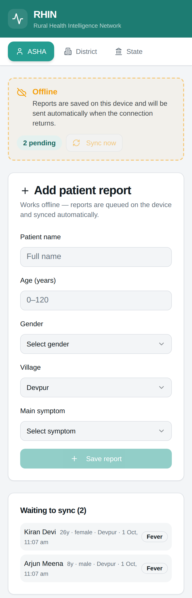
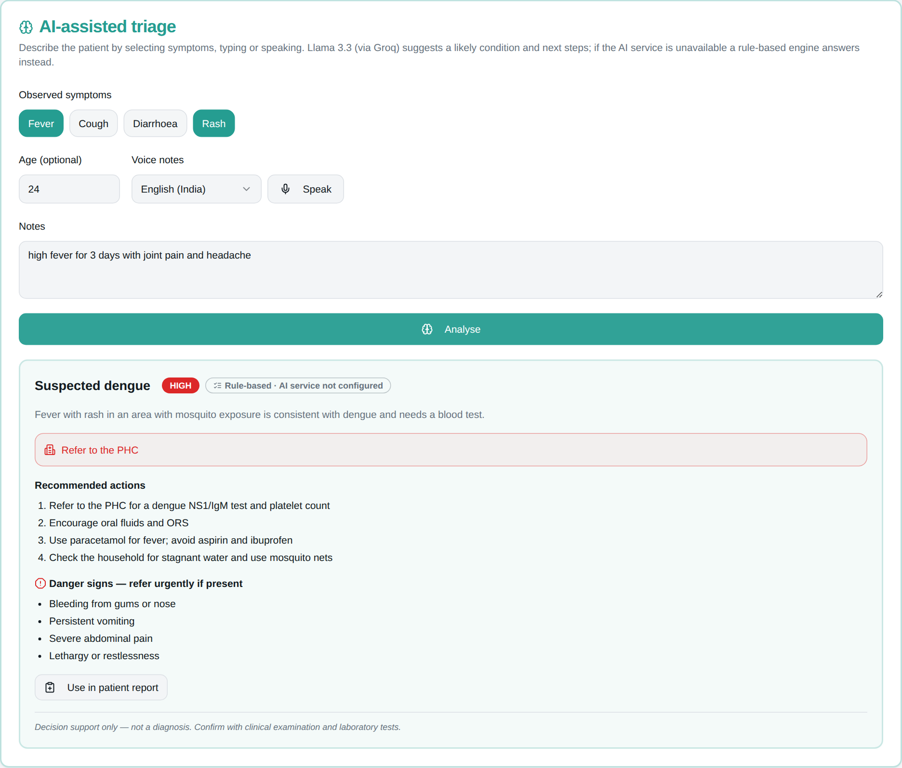
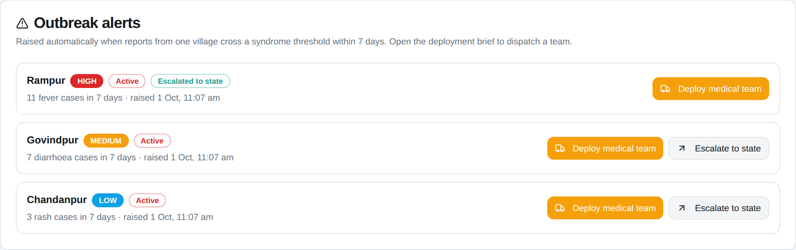
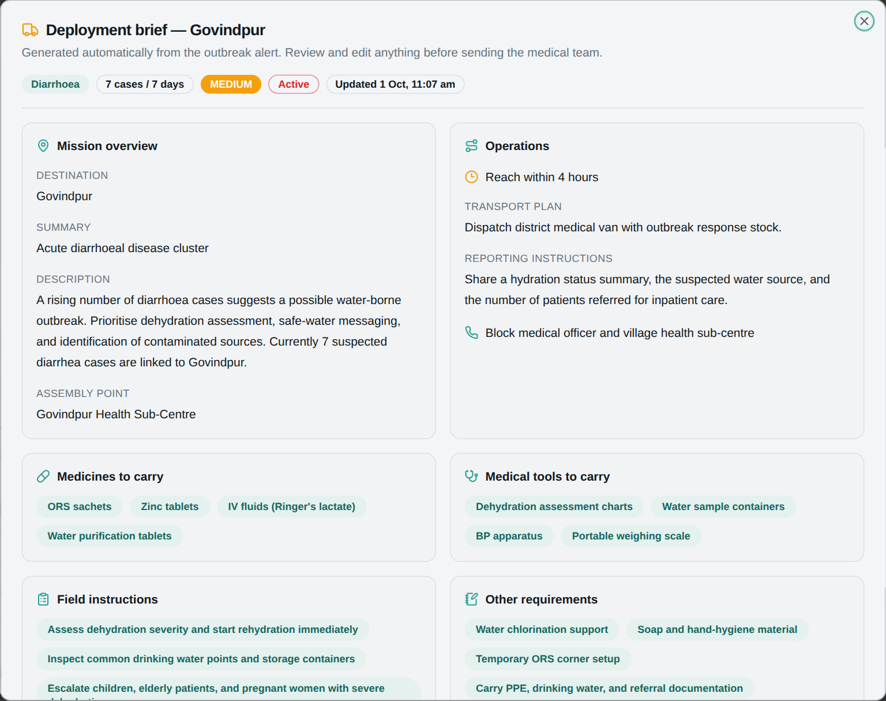
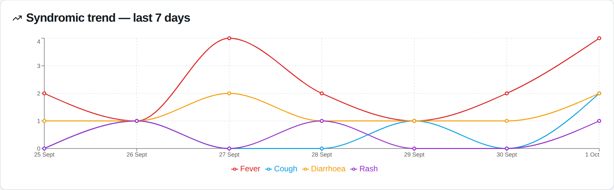
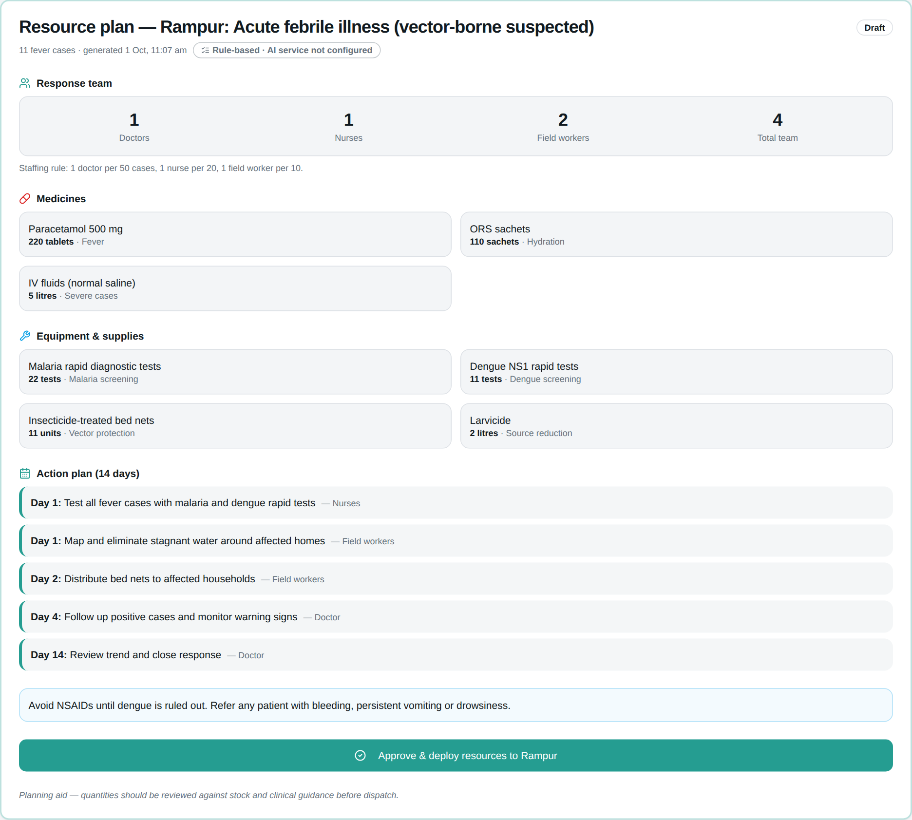
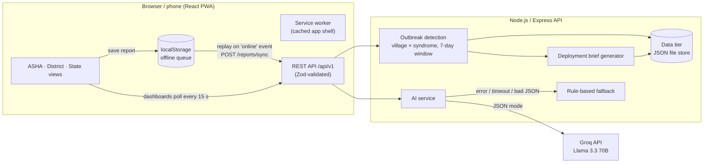

<div align="center">


# RHIN — Rural Health Intelligence Network

**Offline-first disease surveillance for rural India — from the ASHA worker's phone to the state health office.**


[](https://render.com/deploy?repo=https://github.com/MehveenFatima/_RHIN)

</div>

---

## Overview

Outbreaks in rural areas are often noticed late: frontline health workers record cases on paper or in areas with
poor connectivity, and the data reaches district officials days later.

RHIN is a prototype of a three-level surveillance workflow inspired by India's
[Integrated Disease Surveillance Programme (IDSP)](https://idsp.mohfw.gov.in/), where frontline workers report
**syndromes** (fever, cough, diarrhoea, rash) rather than lab-confirmed diagnoses:

| Level | User | What they do in RHIN |
|---|---|---|
| **Field** | ASHA worker | Records patient reports — even with no network — and gets AI-assisted triage guidance |
| **District** | District health officer | Receives automatic outbreak alerts, edits a pre-filled deployment brief and dispatches a medical team |
| **State** | State health officer | Monitors trends and escalated outbreaks and generates AI-drafted resource plans |

All three views share one backend, so a report synced from a phone appears on the district and state dashboards
(which poll every 15 seconds) without a reload.

> **Prototype notice:** RHIN is a student project for demonstration. Villages and patients in the demo data are
> fictional, detection thresholds are illustrative (not official IDSP trigger levels), and AI output is decision
> support — not a diagnosis.

## Key features

- **Offline-first field reporting.** The app shell is cached by a service worker (installable PWA), so the report
  form opens without a connection. Reports are queued in `localStorage` with a client-generated UUID and **replayed
  automatically** when the browser fires its `online` event, on start-up, and every 30 s while the server is
  unreachable. The server ignores IDs it has already stored, so replaying a batch never double-counts cases.
- **Automated outbreak detection.** Every sync re-runs a detection pass that clusters reports by
  **village × syndrome over a rolling 7-day window**. Crossing a threshold raises an alert; severity
  (low → medium → high) only escalates while the alert is open; reaching *high* auto-escalates it to the state level.
- **Pre-filled deployment briefs.** Each new alert gets a dispatch brief — medicines, equipment, field instructions,
  transport and response window chosen by syndrome and severity — that the district officer can edit before sending
  the team.
- **AI-assisted triage** (Llama 3.3 70B via Groq). Symptoms, age and free-text or **voice notes** (Web Speech API;
  English, Hindi, Telugu) return a likely condition, risk level, actions and danger signs.
- **AI resource planning.** For any open alert the state officer can generate a medicines/equipment list and a
  day-by-day action plan.
- **Rule-based fallback.** If the Groq key is missing, the call times out, or the model returns malformed or
  wrongly-shaped JSON, both AI features fall back to a deterministic rule engine. Every result is labelled with its
  source (`AI · llama-3.3-70b-versatile` or `Rule-based`).
- **Leaflet surveillance map** coloured by the most severe open alert in each village, plus **Recharts** trend and
  top-village charts.

## Screenshots

| Offline capture (mobile) | AI-assisted triage |
|---|---|
|  |  |

**District — automatic outbreak alerts**



**District — pre-filled deployment brief**



**State — syndromic trend and resource plan**




<sub>Screenshots were taken with no Groq key configured, so AI results show the rule-based fallback.</sub>

## Tech stack

| Layer | Technology |
|---|---|
| Frontend | React 18, TypeScript, Vite, Tailwind CSS, shadcn/ui (Radix primitives), TanStack Query, React Router |
| Maps & charts | Leaflet + React-Leaflet (OpenStreetMap tiles), Recharts |
| Offline | `vite-plugin-pwa` (Workbox service worker), `localStorage` report queue |
| Voice input | Web Speech API (browser `SpeechRecognition`) |
| Backend | Node.js 20+, Express 5, TypeScript, Zod validation, Helmet, express-rate-limit |
| AI | Groq Chat Completions API (OpenAI-compatible), model `llama-3.3-70b-versatile`, JSON mode |
| Data | JSON file store with atomic writes (see [design decisions](#engineering-decisions)) |
| Testing | Vitest, Supertest, Testing Library, Playwright (end-to-end) |
| CI / Deploy | GitHub Actions; Render Blueprint (`render.yaml`) |

There is no authentication — the role tabs are open for demonstration (see [future work](#future-improvements)).

## Architecture



**Request flow for a field report:** the form writes to the local queue → `OfflineSyncProvider` posts the batch to
`/reports/sync` → the server stores unseen IDs, re-runs detection, creates or updates alerts and their briefs, and
returns guidance for the worker → the worker's queue is cleared for every accepted *or duplicate* ID.

In production the Express server also serves the built frontend, so the whole app deploys as **one service on one
origin** (no CORS needed).

### AI integration

| | Triage (`POST /ai/triage`) | Resource plan (`POST /alerts/:id/plans`) |
|---|---|---|
| Input | Syndromes, age, notes / voice transcript | Village, syndrome, case count, severity |
| Model output | `likelyCondition`, `riskLevel`, `summary`, `recommendations[]`, `redFlags[]`, `referToPHC` | `condition`, `durationDays`, `medicines[]`, `equipment[]`, `actions[]`, `notes` |
| Computed in code | — | Staffing: 1 doctor / 50 cases, 1 nurse / 20, 1 field worker / 10 |
| Fallback | Weighted symptom + keyword rules over 8 conditions, extra caution for under-5s and over-65s | Syndrome templates with quantities scaled by case count |

The Groq client (`backend/src/services/llm.ts`) requests `response_format: { type: "json_object" }` at temperature
0.2, aborts after `LLM_TIMEOUT_MS`, and validates the reply with a Zod schema. Any failure raises an `LlmError`
and the caller returns the rule-based result with a `fallbackReason`. The system prompt instructs the model not to
diagnose and not to recommend antibiotics without clinical assessment. There is no retrieval/RAG component.

### Outbreak detection rules

Clusters are counted per **village × syndrome** over the last 7 days (`backend/src/domain/detection.ts`):

| Syndrome | Alert | Medium | High (auto-escalated) |
|---|---|---|---|
| Fever | 5 | 7 | 10 |
| Cough | 5 | 7 | 10 |
| Diarrhoea | 5 | 7 | 10 |
| Rash | 3 | 5 | 8 |

Reports recorded before an alert was resolved are ignored for that cluster, so a resolved outbreak is not
immediately re-raised by old cases.

## Engineering decisions

- **Idempotent sync over "exactly once" delivery.** Mobile connections drop mid-request. Client-generated UUIDs make
  retries safe: the server reports `accepted` and `duplicates`, and the client removes both from its queue.
- **The LLM never decides numbers that can be computed.** Staffing is derived from case counts in code; the model
  only drafts item lists and actions, and every reply is schema-validated before use.
- **Graceful degradation.** The app is fully usable without an API key — the rule engine answers and the UI says so.
- **Shared types.** `shared/types.ts` is imported by both the React app and the API, so the contract can't drift.
- **JSON file store behind a `Store` class.** Keeps the prototype dependency-free to run and deploy. Writes are
  serialised and atomic (temp file + rename). The class boundary is where PostgreSQL would plug in.
- **Single deployable.** Express serves `dist/` with an SPA fallback, under a Helmet CSP that allows only OpenStreetMap
  tiles and Google Fonts as third-party origins. AI endpoints are rate-limited (20 requests/min per IP).

## Project structure

```
.
├── backend/                 Express API (TypeScript)
│   ├── src/
│   │   ├── domain/          Pure logic: detection, briefs, triage & resource rules
│   │   ├── services/        Groq client (llm.ts) and AI orchestration with fallback (ai.ts)
│   │   ├── store/           JSON-file data tier and demo seed data
│   │   ├── routes/          REST routes and Zod request schemas
│   │   ├── middleware/      Error handling
│   │   ├── app.ts           Express app factory (also serves the built frontend)
│   │   └── index.ts         Entry point
│   ├── test/                Vitest + Supertest suites
│   └── .env.example
├── shared/                  Types and village list used by frontend and backend
├── src/                     React frontend
│   ├── components/          Role views, map, dialogs (asha/, district/, state/)
│   │   └── ui/              shadcn/ui primitives
│   ├── hooks/               Offline sync provider, React Query hooks
│   ├── lib/                 API client, offline queue, labels
│   ├── pages/               Layout and 404
│   └── test/                Frontend tests
├── public/                  Icons, PWA assets
├── e2e/                     Playwright end-to-end tests (offline replay, dispatch, planning)
├── docs/screenshots/
├── .github/workflows/ci.yml Lint, type-check, test and build on every push/PR
└── render.yaml              One-click Render deployment
```

## Getting started

**Prerequisites:** Node.js 20 or newer (22 recommended, see `.nvmrc`) and npm.

```bash
git clone https://github.com/MehveenFatima/_RHIN.git
cd _RHIN
npm run setup                          # installs frontend + backend dependencies
cp backend/.env.example backend/.env   # then add your Groq key (optional)
npm run dev                            # API on :5000, web app on http://localhost:8080
```

`npm run dev` starts both servers; Vite proxies `/api` to the backend. On first start the API seeds demo reports
that produce one high, one medium and one low alert.

To run the production build locally as a single server:

```bash
npm run build:all   # builds the frontend into dist/ and the API into backend/dist/
npm start           # serves app + API on http://localhost:5000
```

### Environment variables

Backend (`backend/.env`, see [`backend/.env.example`](backend/.env.example)):

| Variable | Default | Purpose |
|---|---|---|
| `GROQ_API_KEY` | *(empty)* | Groq key from [console.groq.com/keys](https://console.groq.com/keys). Without it, AI features use the rule-based fallback. |
| `GROQ_MODEL` | `llama-3.3-70b-versatile` | Model for triage and planning |
| `LLM_TIMEOUT_MS` | `15000` | Abort the AI call and fall back after this many ms |
| `PORT` | `5000` | API port |
| `DATA_FILE` | `./data/rhin.json` | Where data is persisted (git-ignored) |
| `SEED_DEMO_DATA` | `true` | Seed demo reports when the store is empty |
| `CORS_ORIGINS` | *(empty)* | Comma-separated origins, only needed if the frontend is hosted elsewhere |
| `STATIC_DIR` | `../dist` | Built frontend to serve |

Frontend (optional, `.env.local`): `VITE_API_URL` — API base URL if it is not on the same origin.

`.env` files are git-ignored. Never commit a real key.

## API

Base path: `/api/v1`. All bodies are JSON; invalid input returns `400` with field-level `issues`.

| Method | Endpoint | Description |
|---|---|---|
| `GET` | `/health` | Status and whether the LLM is configured |
| `GET` | `/villages` | Monitored villages with coordinates |
| `POST` | `/reports/sync` | Idempotent batch upload `{ reports: [...] }` → `{ accepted, duplicates, alertsCreated, alertsUpdated, guidance }` |
| `GET` | `/reports?days=7` | Reports, newest first |
| `GET` | `/alerts` | Alerts sorted by status and severity |
| `GET` | `/alerts/:id` | One alert |
| `GET` / `PUT` | `/alerts/:id/brief` | Read / partially update the deployment brief |
| `POST` | `/alerts/:id/deploy` | Dispatch a team (`active` → `in-progress`) |
| `POST` | `/alerts/:id/escalate` | Escalate to state `{ reason? }` |
| `POST` | `/alerts/:id/resolve` | Mark resolved |
| `POST` | `/alerts/:id/plans` | Generate a resource plan (AI or fallback) |
| `GET` | `/plans` | All resource plans |
| `POST` | `/plans/:id/deploy` | Approve and deploy a plan |
| `POST` | `/ai/triage` | `{ symptoms, notes?, age? }` → triage result |
| `GET` | `/analytics/stats` · `/analytics/trends` · `/analytics/top-villages` | Dashboard data |

Example:

```bash
curl -X POST http://localhost:5000/api/v1/ai/triage \
  -H "Content-Type: application/json" \
  -d '{"symptoms":["fever","rash"],"notes":"joint pain for 3 days","age":24}'
```

## Testing

```bash
npm test            # frontend + backend unit/integration suites
npm run test:e2e    # browser end-to-end tests (Playwright) against the production build
npm run lint
npm run typecheck
```

Before the first e2e run, install the browser once with `npx playwright install chromium`.

- **Backend (27 tests):** detection thresholds, windowing, severity escalation and resolution handling; the Groq
  client with a mocked `fetch` (JSON mode request, schema mismatch, non-JSON, HTTP and network errors → fallback);
  REST API end-to-end with Supertest (idempotent sync, validation, brief → deploy → escalate → resolve, plan
  generation); file persistence across restarts.
- **Frontend (7 tests):** the offline queue, and the sync provider queuing reports while offline and replaying them
  when the `online` event fires.
- **End-to-end (4 Playwright tests, `e2e/`):** in a real Chromium against the production server — a report saved
  with the network switched off stays on the device, the app shell reloads offline from the service worker, and the
  report reaches the server automatically when the connection returns; rule-based triage is labelled as such; the
  Leaflet map shows all 8 villages and a pre-filled brief dispatches a team; the state view generates and deploys a
  resource plan.

CI runs lint, type-check, unit tests and the production build on every push and pull request, then the
end-to-end suite.

## Deployment

`render.yaml` deploys RHIN as one Render web service: click **Deploy to Render** above (or *New → Blueprint* in
Render), then set `GROQ_API_KEY` in the service's environment settings. The health check is `/api/v1/health`.

On Render's free plan the filesystem is ephemeral, so data resets to the demo seed on each restart or deploy —
fine for a demo; attach a persistent disk or a database for anything more.

## Future improvements

Planned, **not implemented**:

- Authentication and role-based access (each officer sees only their district)
- PostgreSQL instead of the JSON file store
- SMS/WhatsApp notifications to district officers when an alert is raised
- Background Sync API so queued reports upload even after the tab is closed
- Real village/facility master data and configurable thresholds per disease
- Multilingual UI (voice input already supports Hindi and Telugu)

## License

No license has been chosen yet; all rights are reserved by the author until one is added.
